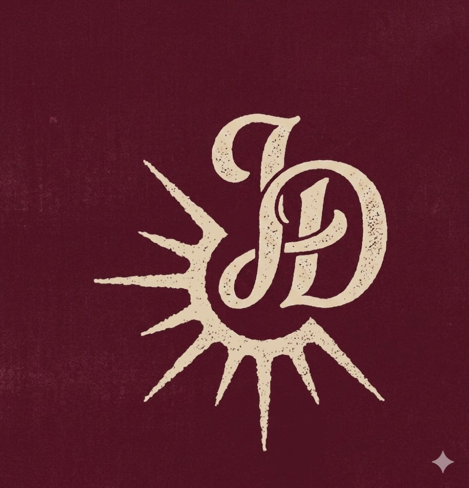
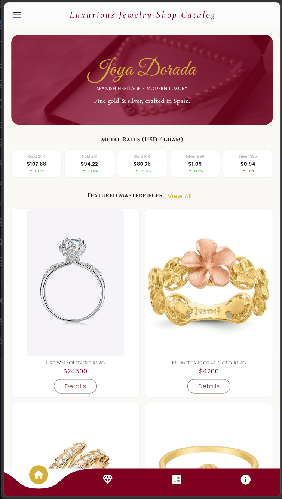
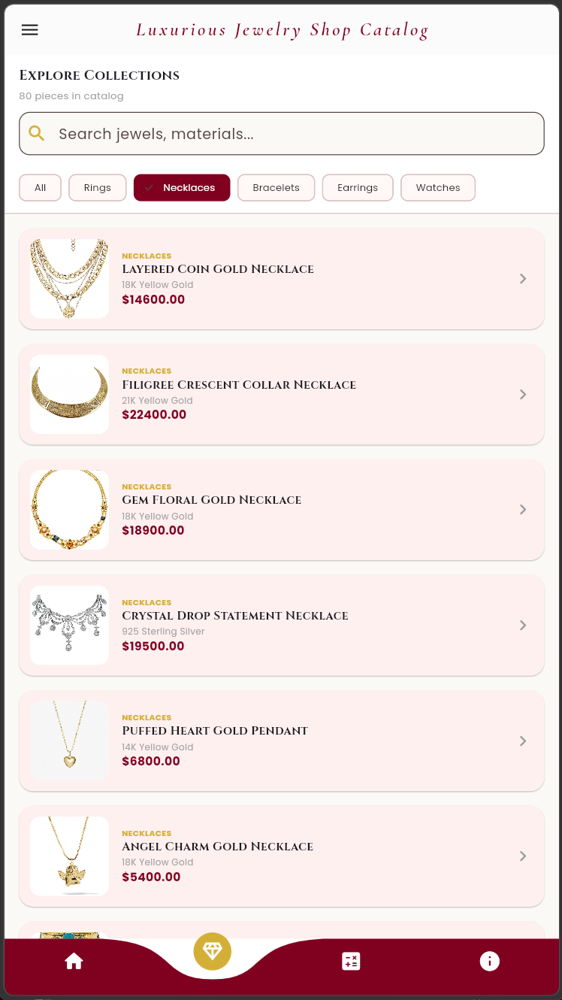
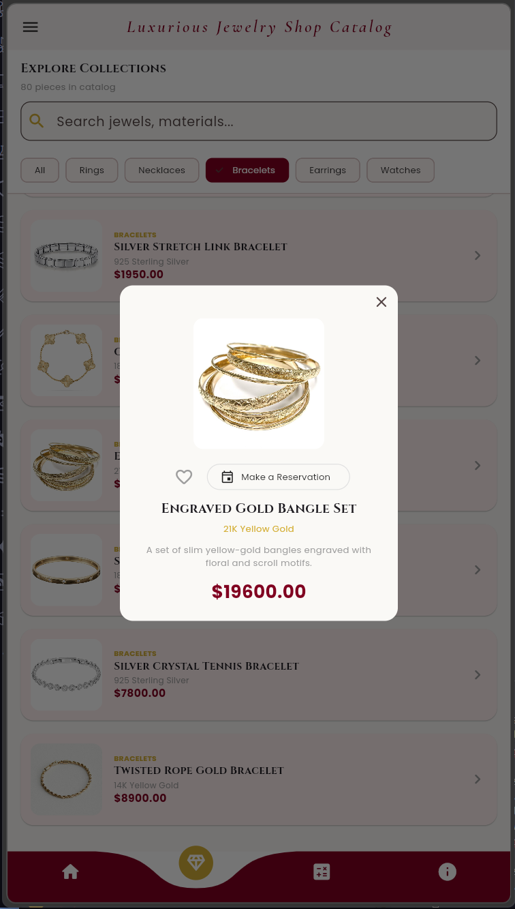
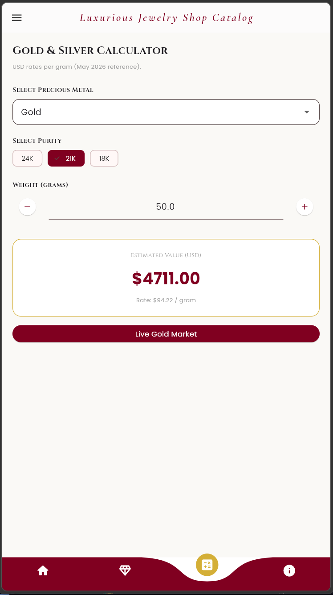
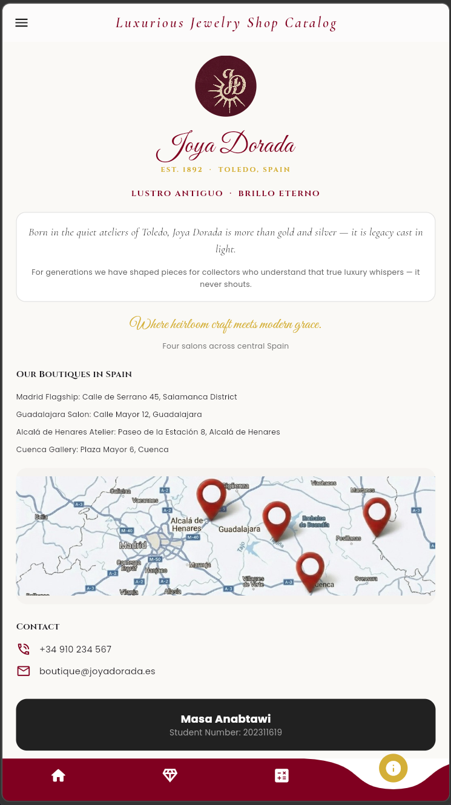
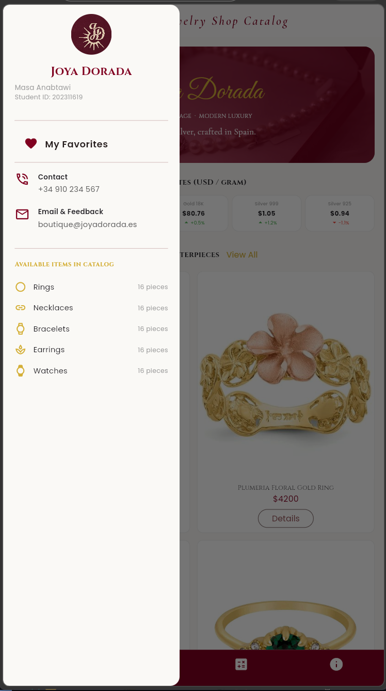
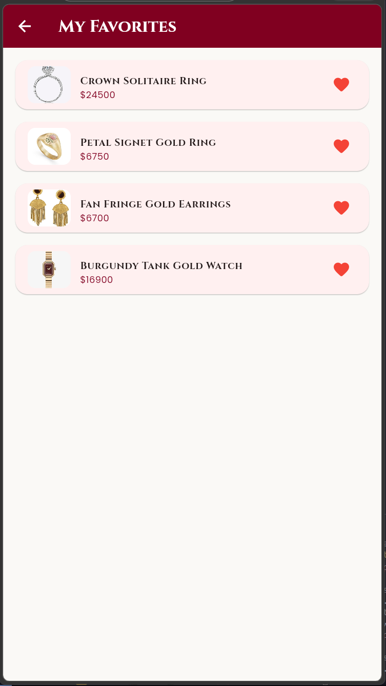

# Joya Dorada — Luxury Jewelry Catalog App


**Joya Dorada** is a Flutter application developed as a final course project. Inspired by Spanish luxury jewelry boutiques, the app serves as a digital showroom where users can browse jewelry collections, explore product details, view daily gold and silver prices, and estimate material values using a built-in calculator.

---

## What the app does
Users can scroll through 80 jewelry pieces (16 per category), filter by category, search by name/material, open product details, mark favorites locally, check daily metal rates, and use a simple gold/silver calculator. The About page explains the brand story and boutique locations in Spain.

## Developer Information
- **Name:** Masa Anabtawi
- **Student Number:** 202311619
- **Course:** Flutter - Mobile App Development - Final Project

---
## Project structure (MVC-style)
```
assets/
├── logo/
│   └── joya_dorada_logo.png
└── images/
    ├── bracelets/
    ├── earrings/
    ├── necklaces/
    ├── rings/
    ├── watches/
    └── locations.png

lib/
├── main.dart
│
├── models/
│   ├── jewelry_model.dart
│   ├── category_model.dart
│   └── market_price_model.dart
│
├── controllers/
│   ├── app_images.dart
│   ├── bracelets_controller.dart
│   ├── calculator_controller.dart
│   ├── catalog_controller.dart
│   ├── earrings_controller.dart
│   ├── market_prices_controller.dart
│   ├── necklaces_controller.dart
│   ├── rings_controller.dart
│   └── watches_controller.dart
│
└── views/
    ├── components/
    │   ├── custom_drawer.dart
    │   ├── joya_app_bar.dart
    │   └── jewelry_image.dart
    │
    ├── about_screen.dart
    ├── calculator_screen.dart
    ├── favorites_screen.dart
    ├── home_screen.dart
    ├── main_navigation.dart
    ├── product_details_dialog.dart
    └── shop_screen.dart
```

---

---

## Screenshots

| Logo | Home | Shop |
| :---: | :---: | :---: |
|  |  |  |
| **Details** | **Calculator** | **About** |
|  |  |  |
| **Drawer** | **Favorites** | |
|  |  | |

---

## Features
1. **Home** — Welcome banner, gold/silver rate cards, featured grid (2 columns).
2. **Shop** — `ListView.builder` with category chips (All, Rings, Necklaces, Bracelets, Earrings, Watches) and search/filter functionality.
3. **Details Dialog** — Popup dialog details showing the image, material info, description, price, and reservation/favoriting capabilities with back navigation (`setState`).
4. **Calculator (unique feature)** — Gold/Silver dropdown, purity chips, gram input with +/- buttons, live total and url-button to show real gold/silver stock market prices.
5. **About** — Brand story, locations, contact info.
6. **Drawer** — Contact, email, help, settings, developer info,favorites page navigation.
7. **Curved bottom navigation** — Home, Shop, Calculator, About.
8. **Favorites Page** — List of favorite items.
9. **App logo** - A simple elegant logo that represents the brand.

---

##
## Rubric Checklist & Compliance Matrix

| Rubric Criteria | Requirement | Joya Dorada Compliance |
| :--- | :--- | :--- |
| **Project Setup & GitHub** | Runs correctly, clean project, minimum 4 commits. | **Done.** The project compiles and runs correctly, 5 commit stages. |
| **UI Complexity & Layout** | Scaffold, AppBar, Drawer, BottomNav, Row, Column, Container, Card, ListView. | **Done.** I used standard `Scaffold`, custom `AppBar` (`JoyaAppBar`), a custom `Drawer` (`CustomDrawer`), a premium `BottomNav` (`CurvedNavigationBar`), and layout widgets like `Row`, `Column`, `Container`, `Card`, and `ListView.builder`. |
| **Screens & Navigation** | Minimum 4 screens, pass data to details screen. | **Done.** I implemented **5 screens** (`HomeScreen`, `ShopScreen`, `CalculatorScreen`, `AboutScreen`, and `FavoritesScreen`) along with an interactive product details popup dialog (`ProductDetailsDialog`), passing the `JewelryModel` data object directly to it. |
| **Data Handling** | Models, List of objects, ListView.builder, search/filter. | **Done.** I created 3 model classes (`JewelryModel`, `CategoryModel`, `MarketPriceModel`), managed list objects in `CatalogController`, and implemented dynamic search and category chip filtering in `ShopScreen`. |
| **Assets & Packages** | Assets, network images, external packages. | **Done.** I configured local assets, network image loading, and integrated three pub.dev packages: `google_fonts`, `curved_navigation_bar`, and `url_launcher`. |
| **OOP & Dart Understanding** | Functions, loops, classes, and 2 OOP concepts. | **Done.** I utilized functions, lists, loops, classes, and implemented OOP concepts (Encapsulation, Inheritance, Polymorphism/Interfaces, Abstraction). |
| **Code Organization (MVC)** | models/, views/ (with a components/ subfolder), controllers/ directories. | **Done.** I structured the codebase cleanly following MVC pattern: `lib/models/`, `lib/controllers/`, `lib/views/`, and `lib/views/components/`. |


---

##
## Mandatory Complex Features Checklist

| Mandatory Complex Feature | Joya Dorada Implementation |
| :--- | :--- |
| **Minimum 4 screens** (Home, List, Details, Profile/About) | **Done.** Screens: `HomeScreen` (Home), `ShopScreen` (List), `AboutScreen` (Profile/About), `FavoritesScreen` (Favorites list), and `CalculatorScreen` (Live estimation tool), plus `ProductDetailsDialog` for item details. |
| **Drawer OR Bottom Navigation Bar** (with at least 3 items) | **Done.** I implemented both a custom `Drawer` (`CustomDrawer`) and a curved bottom navigation bar (`CurvedNavigationBar`) with 4 tabs. |
| **ListView.builder from a List of model objects** | **Done.** I used `ListView.builder` to dynamically display lists of items mapped from `JewelryModel` objects in `ShopScreen` and `FavoritesScreen`. |
| **Create at least 2 model classes** | **Done.** I created 3 model classes: `JewelryModel`, `CategoryModel`, and `MarketPriceModel`. |
| **Create at least 1 controller/helper class** | **Done.** I created `CatalogController` to combine and filter products,each category has its own `Controller` for its items that has title, description, price, image url, category, material and if featured, and `MarketPricesController` to manage metal rates. |
| **Use asset images and network images** | **Done.** I loaded brand logos and product items using local assets (`Image.asset`), and welcome shop banners using network urls (`Image.network`). |
| **Use at least one package from pub.dev** | **Done.** I integrated 3 packages: `google_fonts`, `curved_navigation_bar`, and `url_launcher`. |
| **Use navigation and pass data from list screen to details screen** | **Done.** I passed the `JewelryModel` object reference to `ProductDetailsDialog` and showed it via `showDialog`. |
| **Add search OR filter feature** | **Done.** I added a real-time text search field and horizontal category chips to filter products in `ShopScreen`. |
| **Use at least 2 OOP concepts** | **Done.** I applied OOP concepts (Encapsulation, Abstraction) |
| **Use GitHub with at least 4 commits** | **Done.** |
| **Add README with screenshots and explanation** | **Done.** I created this `README.md` with screenshots and clean explanation. |

---

## Dependencies
- Flutter / Dart
- `google_fonts` (Playfair Display, Cinzel, Great Vibes, Poppins)
- `curved_navigation_bar`
- `url_launcher`
- Asset images + network images

---


## OOP Concepts Used

### 1. Encapsulation

The `JewelryModel` class encapsulates item state such as `isFavorite` and `isReserved`, exposing controlled methods (`toggleFavorite()` and `toggleReserved()`) to modify these values. Private state variables (e.g., `_selectedCategory`) are also used throughout the application to restrict direct access.

### 2. Abstraction

Controllers such as `CatalogController`, `CalculatorController`, and `MarketPricesController` hide business logic from the UI. Screens simply request data or calculations without needing to know how products are combined, filtered, or processed internally.

### 3. Inheritance

Flutter widgets in the application inherit from framework classes such as `StatelessWidget` and `StatefulWidget` to obtain widget lifecycle and rendering capabilities.

### 4. Polymorphism / Interfaces

The project uses Flutter's polymorphic widget system through overridden methods such as `build()` and interfaces such as `PreferredSizeWidget` in `JoyaAppBar`.

---

## Git commit stages 
1. Initial Flutter project setup  
2. Add application models
3. Add catalog and data controllers
4. Implement screens and widgets
5. Connect MVC layers and finalize application

